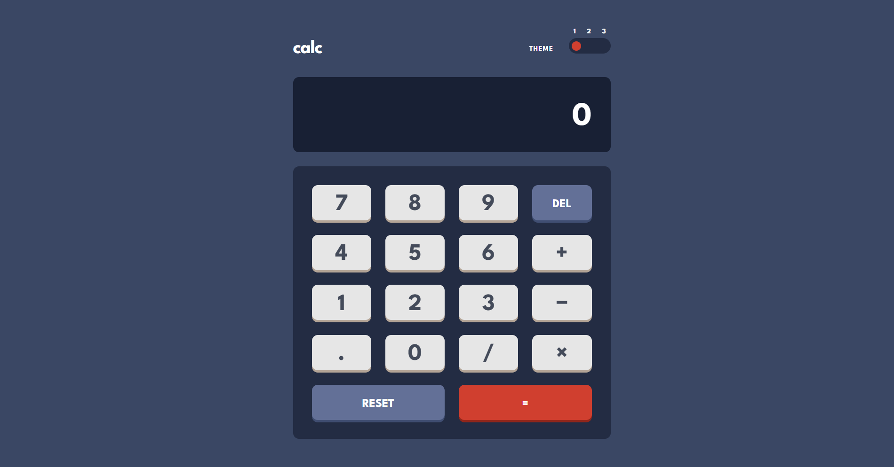
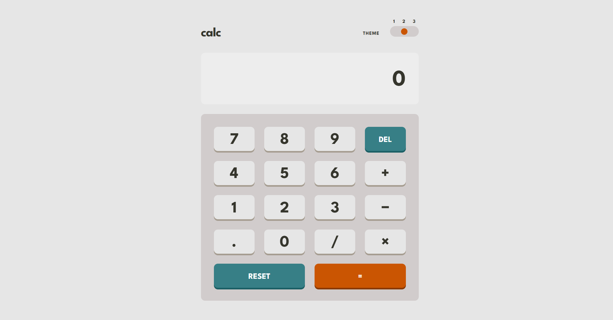
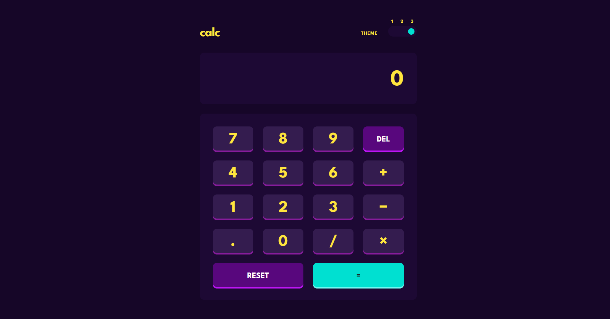
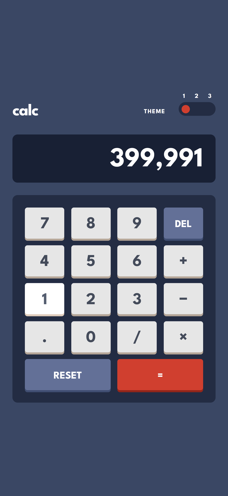
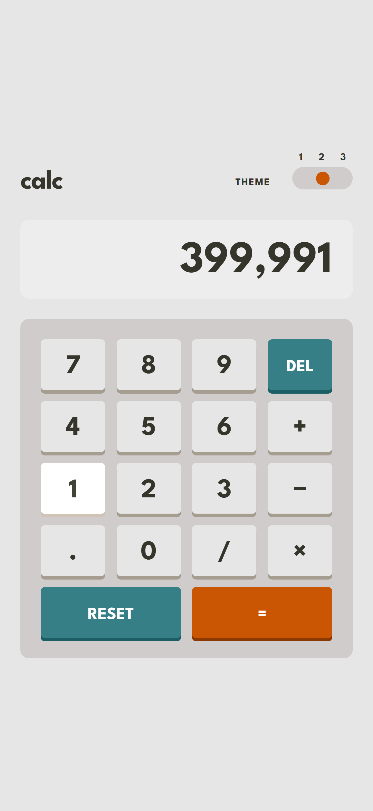
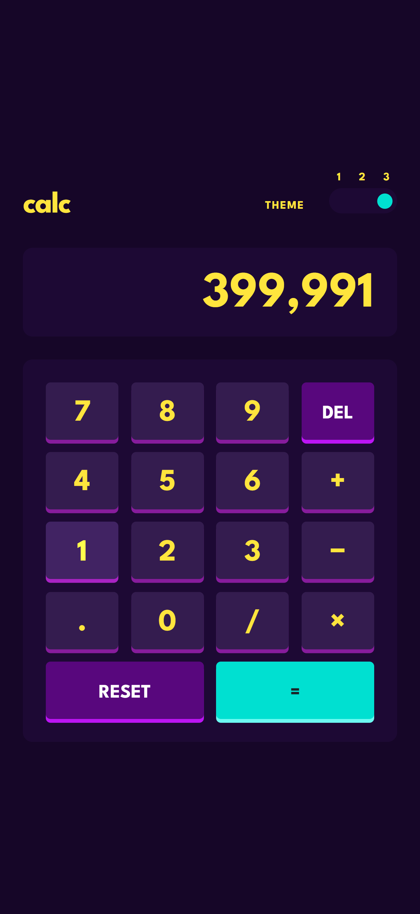

# 🧮 Multi-Theme Calculator App

This responsive calculator application was created to solve the Frontend Mentor Calculator App challenge. It includes three colour themes, smooth interactions, keyboard support, and a responsive layout for mobile and desktop screens.

---

## 📑 Table of Contents

- [🔍 Overview](#-overview)
  - [🎯 The Project](#-the-project)
  - [📸 Screenshot](#-screenshot)
  - [🔗 Links](#-links)
- [⚙️ My Process](#️-my-process)
  - [🛠 Built with](#-built-with)
  - [📚 What I Learned](#-what-i-learned)
  - [🚀 Continued Development](#-continued-development)
  - [🔎 Useful Resources](#-useful-resources)
- [👩‍💻 Author](#-author)
- [🙏 Acknowledgements](#-acknowledgements)

---

## 🔍 Overview

### 🎯 The Project

Users should be able to:

- Perform addition, subtraction, multiplication, and division
- Enter decimal values and display negative results
- Delete the final entered digit
- Reset the calculator
- Switch between three colour themes
- Have their selected theme saved in the browser
- Receive an initial theme based on their system colour preference
- Use the calculator with a mouse, touchscreen, or keyboard
- View a responsive layout on mobile and desktop screens
- See hover, active, and keyboard-focus states for interactive elements

### 📸 Screenshot

#### Desktop view
<table>
  <tr>
    <td>
      
    </td>
    <td>
      
    </td>
  </tr>
</table>

#### Mobile view
<table>
  <tr>
    <td>
      
    </td>
    <td>
      
    </td>
    <td>
      
    </td>
  </tr>
</table>

### 🔗 Links

- **Live Site URL**: [https://dulaagamage.github.io/calculator-app/](https://dulaagamage.github.io/Calculator-app)
- **GitHub Repository**: [https://github.com/dulaagamage/Calculator-app](https://github.com/dulaagamage/Calculator-app)
- **Frontend Mentor Challenge**: [Calculator App Challenge](https://www.frontendmentor.io/solutions/calculator-app-BT8SQCoJhj)

---

## ⚙️ My Process

### 🛠 Built with

- Semantic **HTML5**
- **Tailwind CSS v4**
- **Sass/SCSS**
- **CSS Grid**
- **CSS custom properties**
- **Vanilla JavaScript**
- **Vite**
- Mobile-first responsive workflow
- Browser `localStorage`
- `prefers-color-scheme`
- Accessible labels, keyboard controls, and focus states
- 💻 VS Code

### 📚 What I Learned

This project gave me hands-on practice in:

- Building responsive layouts with Tailwind CSS utilities
- Creating a four-column calculator keypad with CSS Grid
- Using Sass maps and loops to generate three colour themes
- Creating reusable button styles with Sass mixins
- Managing calculator state with vanilla JavaScript
- Handling chained calculations and decimal values
- Formatting large numbers with thousands separators
- Preventing invalid input and division-by-zero errors
- Saving user preferences with `localStorage`
- Detecting system theme preferences with `prefers-color-scheme`
- Supporting keyboard interaction and accessible focus states
- Building optimized production files using Vite

### 🚀 Continued Development

Future improvements:

- Add a calculation-history panel
- Add memory buttons such as M+, M−, MR, and MC
- Add percentage and square-root operations
- Add automated tests for calculator functions
- Convert the calculator into reusable UI components
- Add a Progressive Web App configuration for offline use

### 🔎 Useful Resources

- 🎨 [Tailwind CSS Documentation](https://tailwindcss.com/docs) – Utility classes and responsive styling
- 💅 [Sass Documentation](https://sass-lang.com/documentation/) – Maps, loops, mixins, and nesting
- 🧠 [MDN Web Docs](https://developer.mozilla.org/) – JavaScript, accessibility, and browser APIs
- ⚡ [Vite Documentation](https://vite.dev/guide/) – Development server and production builds
- 🧩 [Frontend Mentor](https://www.frontendmentor.io/) – Challenge files and design references

---

## 👩‍💻 Author

- GitHub – [@dulaagamage](https://github.com/dulaagamage)
- LinkedIn – [Dulanjalee Gamage](https://www.linkedin.com/in/dulanjalee-gamage-01a7aa207/)
- Email – dulaagamage123@gmail.com

---

## 🙏 Acknowledgements

This project was completed as part of the Frontend Mentor Calculator App challenge.

Special thanks to Frontend Mentor for providing the design references and style guide, and to the developer community for the documentation and learning resources that supported this project. 💻✨

---
